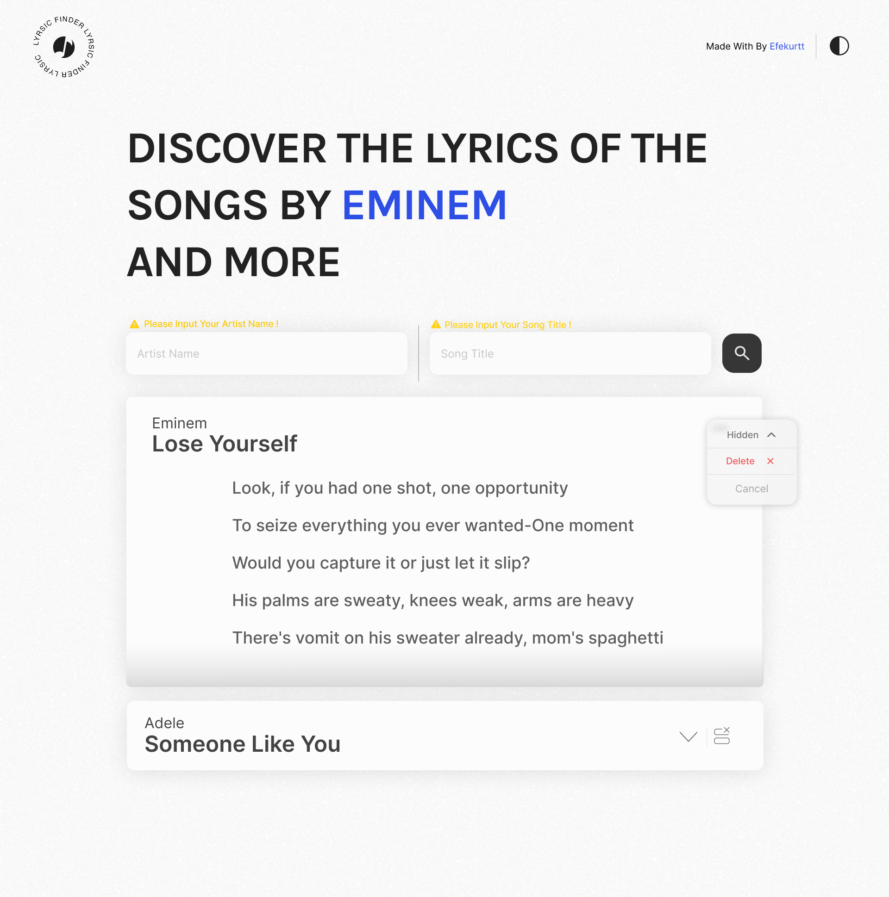
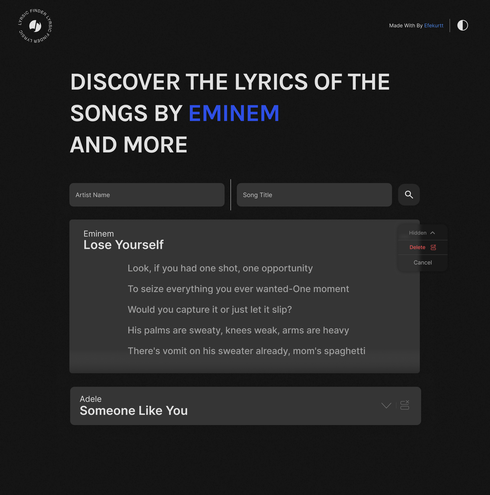

# Lyrics App

A modern web application to find and save your favorite song lyrics. Built with React and TypeScript.

## Features

- Search for song lyrics by artist and song name
- Save your favorite lyrics
- Dark/Light mode support
- Responsive design
- Modern UI with smooth animations

## Technologies Used

- React
- TypeScript
- CSS3
- HTML5
- Lyrics.ovh API


## API

This project uses the [lyrics.ovh](https://lyrics.ovh/) API to fetch song lyrics.


## Getting Started

1. Clone the repository:
```bash
git clone https://github.com/yourusername/lyrics-app.git
```

2. Install dependencies:
```bash
cd lyrics-app
npm install
```

3. Start the development server:
```bash
npm start
```

4. Open [http://localhost:3000](http://localhost:3000) to view it in the browser.


## 📸 Preview

  

